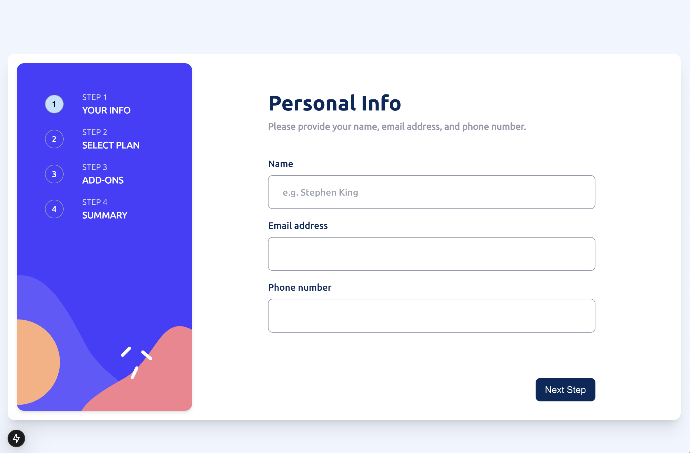

# Frontend Mentor Challenge with Next.js

This is a [Next.js](https://nextjs.org) project bootstrapped with [`create-next-app`](https://nextjs.org/docs/app/api-reference/cli/create-next-app). It incorporates a Frontend Mentor challenge, adhering to a specified front-end style guide.

## Getting Started

First, run the development server:

```bash
npm run dev
# or
yarn dev
# or
pnpm dev
# or
bun dev
```

Open [http://localhost:3000](http://localhost:3000) with your browser to see the result.

## Features

- Responsive design optimized for mobile and desktop.
- Accessible forms with validation using ***Yup*** and ***React Hook Form***.
- Real-time feedback with ***Toastify*** notifications.

## Front-end Style Guide

#### Design Widths:
- Mobile: 375px
- Desktop: 1440px

### Colors

#### Primary
- Marine Blue: ```hsl(213, 96%, 18%)```
- Purplish Blue: ```hsl(243, 100%, 62%)```
- Pastel Blue: ```hsl(228, 100%, 84%)```
- Light Blue: ```hsl(206, 94%, 87%)```
- Strawberry Red: ```hsl(354, 84%, 57%)```

#### Neutral

- Cool Gray: ```hsl(231, 11%, 63%)```
- Light Gray: ```hsl(229, 24%, 87%)```
- Magnolia: ```hsl(217, 100%, 97%)```
- Alabaster: ```hsl(231, 100%, 99%)```
- White: ```hsl(0, 0%, 100%)```

#### Typography
- Body Copy: Font size (paragraph) - 16px
- Font Family: Ubuntu
- Font Weights: 400, 500, 700


### License
This project is licensed under the MIT License. See the LICENSE file for details.